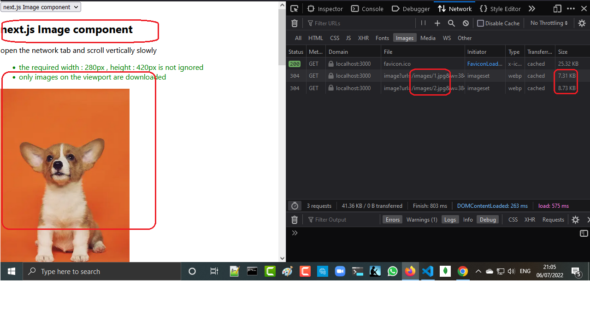
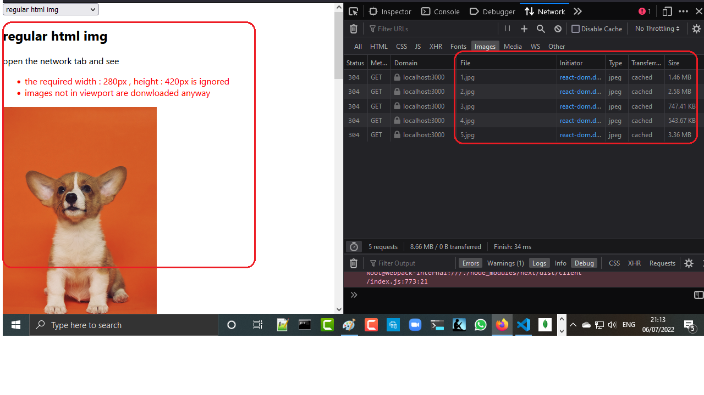

<h2>Motivation</h2>
Experiment with next.js Image component vs regular html img

<h2>Conclusion</h2>

<h3>next.js Image component</h3>
 open the network tab and scroll vertically slowly
<ul>
<li>
    the required width : 280px , height : 420px is not ignored. Thus better performance
</li>
<li>
    only images on the viewport are downloaded. Thus better performance
</li>
</ul>

Notice that we have one image in the viewport so next.js download it and the next image. also note that the original size of the 1.jpg is 1.45MB and the 2.jpg is 2.57MB while in reality with 280x480 used we have 7.31 KB and 8.73 KB respectively

<h3>regular html img</h3>
 open the network tab
<ul>
<li>
    the required width : 280px , height : 420px is ignored
</li>
<li>
    all images are downloaded regardless of their appearance on the viewport
</li>
</ul>

Notice that we have one image in the viewport but all images are downloaded. also the original size of the 1.jpg is 1.45MB and the 2.jpg is 2.57MB while in reality with 280x480 its the SAME

